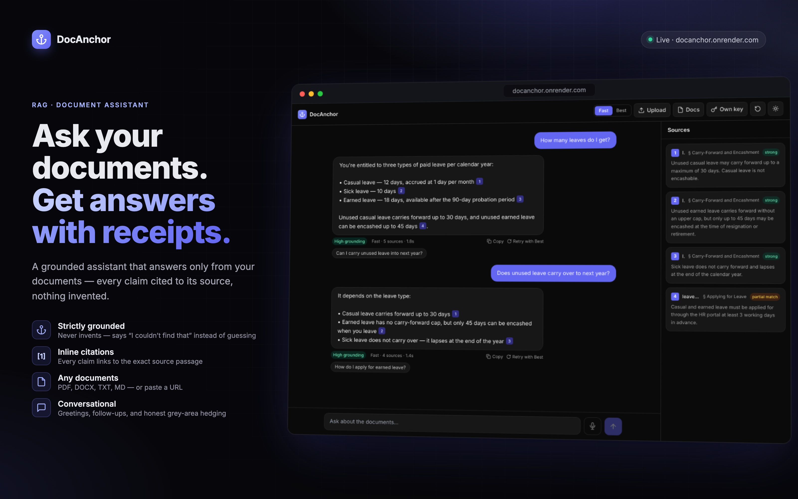
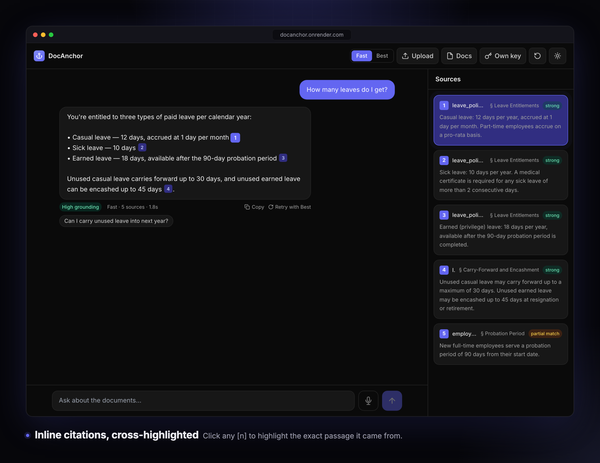
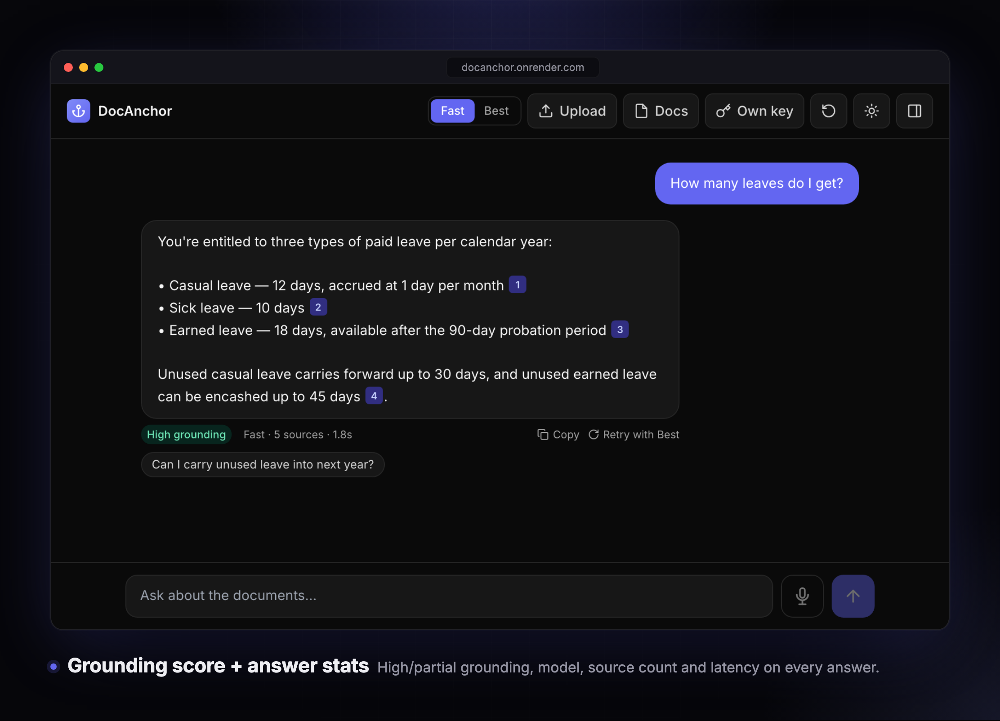
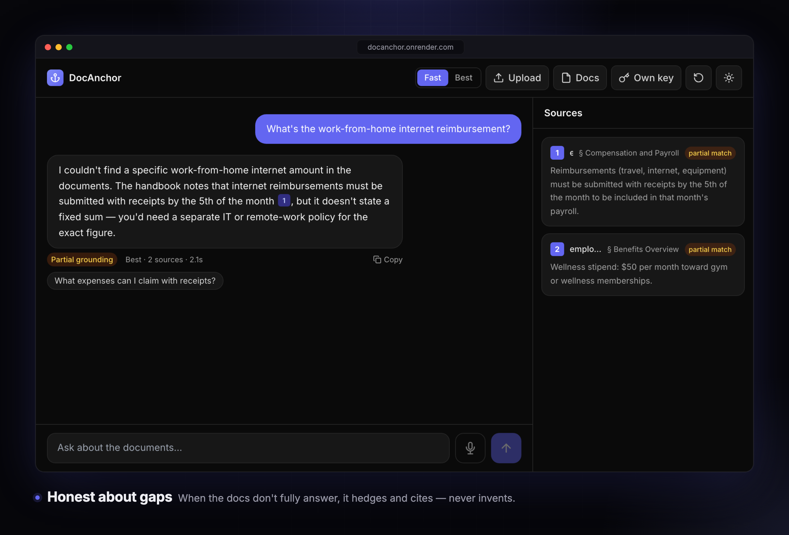
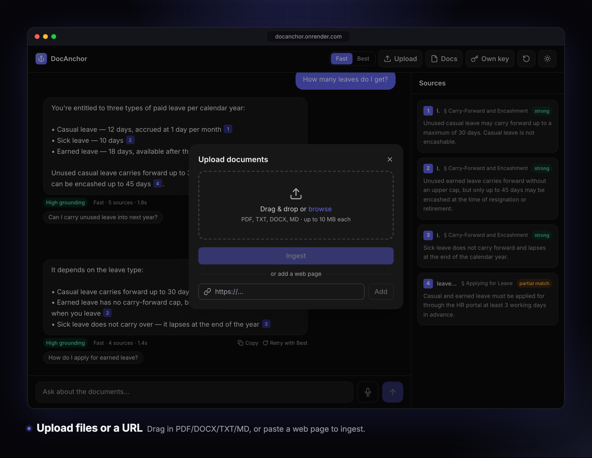
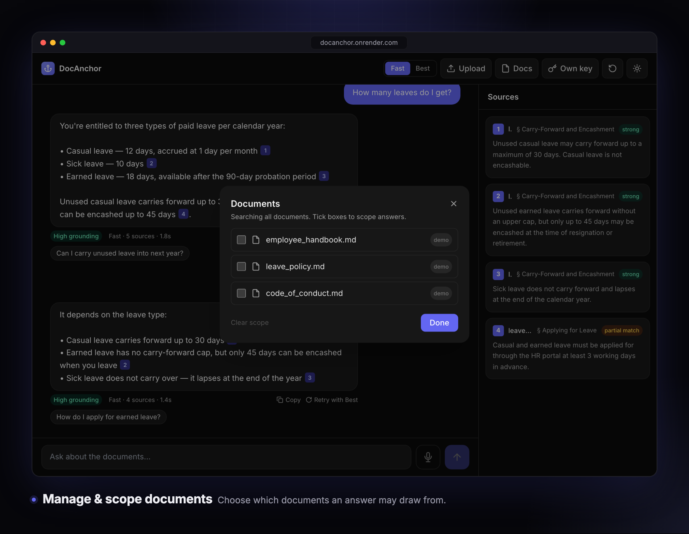

<p align="center">
  
</p>

<h1 align="center">DocAnchor</h1>

<p align="center"><b>Ask your documents. Get answers with receipts.</b></p>

<p align="center">
  A grounded, domain-agnostic RAG assistant that answers <b>only</b> from your documents —
  every claim cited to its source, nothing invented.
</p>

<p align="center">
  <a href="https://docanchor-o5c2.onrender.com"></a>
  
  
</p>

<p align="center">
  
  
  
  
  
  
  
  
  
</p>

---

## What it does

Most LLM chatbots will confidently make things up — unacceptable for HR, legal, policy, or support
documents. **DocAnchor** constrains the model to passages it actually retrieved from *your* documents
and a strict system prompt, so every answer is grounded and traceable.

Upload files (PDF / DOCX / TXT / MD) or paste a URL, then ask in plain language. DocAnchor embeds your
question, retrieves the most relevant chunks from a vector index, and answers **strictly from them** —
attaching a clickable `[n]` citation to every claim. If the documents don't cover something, it says so
instead of guessing. It also handles greetings, multi-turn follow-ups, and grey-area questions where the
docs only partially answer.

**Highlights:** strict grounding · inline citations with source highlighting · grounding score & stats ·
honest grey-area hedging · file **and** URL ingestion · per-document query scoping · history-aware
follow-ups · 8B↔70B model switch · bring-your-own-key · streaming answers · light/dark · one-service Docker deploy.

---

## Features

### Inline citations, cross-highlighted
Every factual claim carries a numbered `[n]` chip that maps to a source card. Click a chip to scroll to
and highlight the exact passage it came from; strong matches and partial (grey-area) matches are visually
distinguished.


### Grounding score + answer stats
Each answer is labelled **High** or **Partial** grounding (derived from how strongly the retrieved
passages matched), alongside the model used, source count, and response latency — so you can gauge
confidence at a glance.


### Honest about gaps
When the documents only partially answer a question, DocAnchor gives the closest supported information,
cites the partial source, and explicitly flags what's missing — rather than refusing outright or inventing
a clean-sounding answer.


### Bring any documents — files or a URL
Drag in PDF / DOCX / TXT / MD, or paste a web page to ingest. Uploads stream **stage-by-stage** progress
(extract → chunk → embed → store), process one file at a time, and recover per-file on error. URL fetching
is SSRF-guarded (public hosts only, bounded download).


### Manage & scope documents
See every loaded document, delete your uploads, and **scope** an answer to just the documents you select —
useful when one corpus contains several unrelated sources.


### And more
History-aware **follow-ups** (the latest message is rewritten into a standalone query so retrieval works
mid-conversation) · a single suggested follow-up after each answer · **Copy** / **Retry with Best (70B)** ·
**model switch** (Fast 8B ↔ Best 70B) · **bring-your-own Groq key** (used per-request, never stored) ·
**streaming** answers with a live typing effect · **session persistence** across refresh · keyboard-friendly,
accessible, light/dark · an animated **boot screen** that covers free-tier cold starts.

---

## Architecture

One FastAPI service serves the built React SPA **and** the API — one repo, one Docker image, one deploy.

```
Browser ── React SPA (Vite + Tailwind + Framer Motion)
   │
   ▼
FastAPI (single service)
   ├── /api/chat          intent → history-aware rewrite → retrieve → grounded, cited answer (NDJSON stream)
   ├── /api/upload        extract → chunk → embed → store, with live stage progress
   ├── /api/ingest-url    fetch (SSRF-guarded) → extract → ingest a web page
   ├── /api/health        keep-alive + DB ping (prevents cold sleep / DB pause)
   ├── /api/session/docs  list & manage a session's documents
   └── /api/reset         clear uploads, restore the demo set
   │
   ▼
Supabase (Postgres + pgvector, HNSW)        Groq LLMs (OpenAI-compatible)
   chunks + 384-dim embeddings               llama-3.1-8b-instant  (Fast, primary)
   match_chunks() cosine RPC                  llama-3.3-70b-versatile (Best, fallback)
   embeddings via fastembed / bge-small
```

No LangChain — the pipeline is hand-built for full control and a small footprint (runs in ~290 MB).

### Tech stack
| Layer | Choice |
|---|---|
| Frontend | React · Vite · Tailwind CSS · Framer Motion |
| Backend | Python 3.11 · FastAPI · Uvicorn |
| Vector DB | Supabase (Postgres + pgvector, **HNSW** cosine index) |
| Embeddings | `fastembed` + **BAAI/bge-small-en-v1.5** (384-dim, ONNX, no torch) |
| LLM | Groq — `llama-3.1-8b-instant` (Fast) / `llama-3.3-70b-versatile` (Best) |
| Deploy | Multi-stage Docker → Render free tier |

### Project structure
```
backend/    main.py · rag.py · llm.py · intent.py · ratelimit.py · migrate.py · seed_demo.py · demo_docs/
frontend/   src/ (App, components, api, icons) · Vite + Tailwind
db/         schema.sql (tables · HNSW index · match_chunks RPC)
marketing/  capture.mjs + render.mjs + HTML templates (product visuals)
Dockerfile · render.yaml · .env.example
```

---

## How grounding & citations work

1. **Intent** — fast local rules route greetings / meta away from retrieval (no wasted LLM calls).
2. **History-aware rewrite** — for follow-ups, the latest message + recent turns are condensed into one
   standalone query (cheap 8B call) before embedding, so retrieval works mid-conversation.
3. **Retrieve** — the query is embedded with `bge-small` and matched via pgvector cosine search (HNSW).
   A **two-threshold** rule splits hits into confident *strong* matches and weaker *partial* (grey-area)
   matches; anything below the floor is discarded.
4. **Generate** — a strict system prompt forbids outside knowledge, requires a `[n]` citation for every
   claim, mandates hedging on partial coverage, and points conflicts out. The answer streams token-by-token.
5. **No match → no hallucination** — if nothing clears the floor, DocAnchor returns
   *"I couldn't find that in the documents provided."* instead of guessing.

On the shared key, usage is rate-limited per-IP and per-model token budget; hitting a limit (or a provider
429) invites you to paste your own Groq key — used per request, never stored or logged.

---

## Run locally

**Prereqs:** Python 3.11+, Node 18+, a Supabase project, a Groq API key.

```bash
# 1. Database — run db/schema.sql once in the Supabase SQL editor
#    (tables + HNSW index + match_chunks RPC). Idempotent.

# 2. Env
cp .env.example .env   # fill SUPABASE_URL, SUPABASE_KEY (service role), GROQ_API_KEY

# 3. Backend
python -m venv .venv && source .venv/bin/activate
pip install -r backend/requirements.txt
cd backend && uvicorn main:app --reload --port 8000   # demo HR docs seed on first boot

# 4. Frontend (dev)
cd frontend && npm install && npm run dev              # http://localhost:5173 (proxies /api → :8000)
```

**Production-style (single service):** `cd frontend && npm run build`, then run uvicorn — FastAPI serves
the built SPA + API at one URL.

**Deploy (Render):** New → Blueprint (uses `render.yaml`) → set `SUPABASE_URL`, `SUPABASE_KEY`,
`GROQ_API_KEY`. The multi-stage Dockerfile builds the SPA, installs deps, and bakes the embedding model
into the image (~290 MB). Set a 10-minute cron on `/api/health` to keep the free instance warm and the
Supabase project active.

---

## Engineering notes

- **Fits the free tier** — `fastembed`/ONNX (no torch) keeps the image to ~290 MB so it runs in Render's
  512 MB; the model is baked into the image (no cold-start download).
- **Resilient retrieval** — uses the pgvector RPC when present, with an in-Python cosine fallback so the
  app still works before the schema migration is applied.
- **One-shot deploy** — set `DATABASE_URL` and the app applies `db/schema.sql` itself on boot.
- **Secrets** — API keys live only in env, are redacted from errors, and are never sent to the frontend.

## How I'd extend this for a client

Per-tenant auth + RLS · hybrid search (BM25 + vectors) + a cross-encoder reranker · OCR for scanned PDFs ·
background ingestion workers for large corpora · an evaluation harness scoring grounding & citation
accuracy on every model or prompt change.

---

<p align="center"><sub>Built with FastAPI · React · Supabase pgvector · Groq · Docker — deployed on Render.</sub></p>
